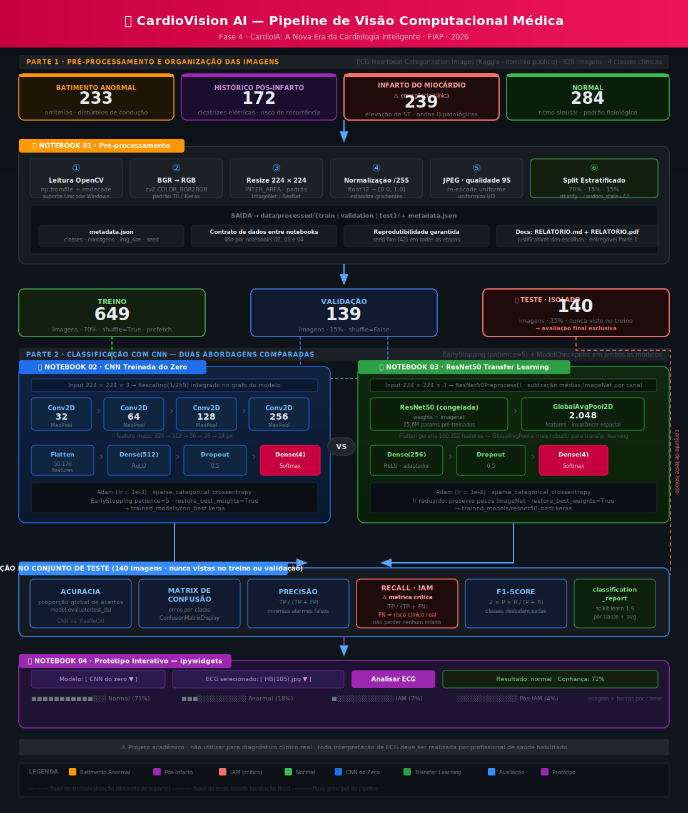
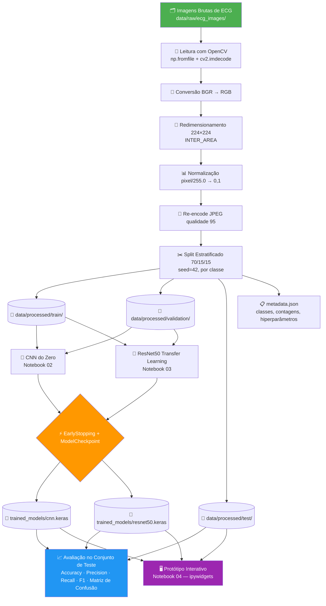

# FIAP — Faculdade de Informática e Administração Paulista

<p align="center">
  
</p>

<h1 align="center">🫀 CardioVision AI</h1>
<h3 align="center">Classificação Automática de Patologias Cardíacas por Análise de Imagens de ECG com Deep Learning</h3>

<p align="center">
  <em>"Cada sinal elétrico do coração carrega uma história. A IA aprendeu a lê-la."</em>
</p>

<p align="center">
  
  
  
  
</p>

<p align="center">
  
  
  
  
  
  
</p>

---

## 📌 Visão Geral

O **CardioVision AI** é o protótipo de Visão Computacional desenvolvido na **Fase 4 do projeto CardioIA — A Nova Era da Cardiologia Inteligente**. Após estruturar o monitoramento contínuo nas fases anteriores, o CardioIA avança para a análise de imagens médicas: um pipeline completo de Deep Learning para classificação automática de eletrocardiogramas (ECG) em quatro categorias clínicas, batimentos normais, arritmias, infarto agudo do miocárdio e histórico pós-infarto.

O projeto responde a um desafio real e globalmente urgente: democratizar o acesso ao diagnóstico cardiológico em contextos onde cardiologistas não estão disponíveis imediatamente. A solução vai além de treinar uma rede neural em imagens médicas, propõe um **pipeline de machine learning rastreável, reprodutível e clinicamente fundamentado**: do dado bruto até a inferência interativa, cada etapa é documentada, justificada e auditável. A arquitetura compara duas abordagens complementares, uma CNN construída do zero e transfer learning sobre ResNet50, produzindo evidências concretas sobre o impacto de representações pré-treinadas em domínios médicos com dados escassos.

> ⚠️ **Aviso médico:** o CardioVision AI é um projeto acadêmico de aprendizado e não deve ser utilizado para diagnóstico clínico real. Toda interpretação de ECG deve ser realizada por profissional de saúde habilitado.

---

## ✅ Critérios de Avaliação — Como Este Projeto os Atende

| Critério | Pontos | Como está implementado |
|---|---|---|
| **Pipeline de pré-processamento implementado** | 3 | `01_preprocessing.ipynb`: leitura com OpenCV, BGR→RGB, redimensionamento 224×224, normalização [0,1], split estratificado 70/15/15, persistência com `metadata.json` |
| **Treinamento e avaliação de CNN do zero** | 2 | `02_cnn_training.ipynb`: CNN sequencial 4 blocos Conv2D (32→64→128→256), Dense(512), Dropout(0.5), avaliado no conjunto de teste com acurácia, precisão, recall, F1 e matriz de confusão |
| **Implementação de Transfer Learning funcional** | 2 | `03_resnet50_training.ipynb`: ResNet50 pré-treinada (ImageNet), base congelada, camada customizada serializável, cabeça classificadora adaptada para 4 classes de ECG |
| **Apresentação dos resultados em protótipo simples** | 2 | `04_prototype_interface.ipynb`: interface ipywidgets com dropdown de imagem e modelo, visualização da imagem original, barras de probabilidade por classe e resultado com confiança |
| **Documentação clara** | 1 | README completo, `RELATORIO.md` e `RELATORIO.pdf` com descrição de etapas e justificativas, `metadata.json` como contrato de dados auditável |
| **Trabalho em equipe (grupo de 2 a 5 integrantes)** | +1  | **4 integrantes** — elegível ao ponto extra; papéis definidos e divididos de forma equilibrada entre PO, Arquitetura, IA e Governança |


---

## 📋 Entregáveis por Parte

### PARTE 1 — Pré-processamento e Organização das Imagens

| Entregável | Arquivo |
|---|---|
| Notebook Python com código de pré-processamento | `notebooks/01_preprocessing.ipynb` |
| Relatório descrevendo etapas e justificativas | `docs/RELATORIO.md` e `docs/RELATORIO.pdf` |

### PARTE 2 — Classificação com CNN

| Entregável | Arquivo |
|---|---|
| Notebook CNN do zero com métricas de avaliação | `notebooks/02_cnn_training.ipynb` |
| Notebook Transfer Learning com métricas de avaliação | `notebooks/03_resnet50_training.ipynb` |
| Prints das métricas (acurácia, matriz de confusão, F1) | Gerados ao executar os notebooks 02 e 03 |
| Protótipo interativo de apresentação dos resultados | `notebooks/04_prototype_interface.ipynb` |

---

## 🌍 Por que isto importa globalmente

Doenças cardiovasculares são a **principal causa de morte no planeta**, responsáveis por aproximadamente **17,9 milhões de vidas por ano** segundo a Organização Mundial da Saúde, mais do que câncer, doenças respiratórias e diabetes combinados. No Brasil, representam mais de **30% dos óbitos anuais**.

O eletrocardiograma é um dos instrumentos diagnósticos mais acessíveis da medicina: custa poucos reais, pode ser realizado em minutos e produz dados ricos sobre o estado elétrico do coração. O problema estrutural: **sua interpretação confiável exige anos de formação especializada**. Em UPAs sobrecarregadas, municípios do interior e países em desenvolvimento, a ausência de um cardiologista disponível pode significar um atraso crítico, e a diferença entre um IAM tratado a tempo e um óbito.

A literatura científica documenta a viabilidade do diagnóstico automatizado por IA. O trabalho de Hannun et al. (2019), publicado na *Nature Medicine*, demonstrou que redes neurais profundas atingem performance equivalente à de cardiologistas na detecção de arritmias em ECG de 30 segundos. O CardioVision AI traduz esses avanços para um contexto acadêmico prático, construindo e avaliando modelos de classificação de ECG por imagem com metodologia rigorosa.

---

## 🎯 Objetivo do Projeto

Construir um **Assistente Cardiológico Virtual** que transforma imagens de ECG simuladas em informações interpretáveis, auxiliando a tomada de decisão clínica. O projeto é estruturado em duas partes que se complementam, conforme o enunciado da Fase 4 do CardioIA:

**PARTE 1 — Pré-processamento e Organização das Imagens:** seleção de dataset público de saúde, aplicação de técnicas de pré-processamento (redimensionamento, normalização, conversão de formatos, split estratificado), documentação do pipeline com justificativas técnicas.

**PARTE 2 — Classificação com CNN:** implementação de CNN treinada do zero, transfer learning com ResNet50, avaliação com métricas clínicas adequadas (acurácia, matriz de confusão, precisão, recall, F1-score) e apresentação dos resultados em protótipo interativo.

### Entregas consolidadas

- Dataset público selecionado: ECG Heartbeat Categorization Images (Kaggle, 928 imagens, 4 classes)
- Pipeline de pré-processamento com OpenCV, estratificação e metadados auditáveis
- CNN treinada do zero com arquitetura sequencial de 4 blocos convolucionais
- Transfer Learning com ResNet50 pré-treinada em ImageNet, camada serializável customizada
- Avaliação completa no conjunto de teste com todas as métricas exigidas
- Protótipo interativo com ipywidgets (notebook interativo, conforme previsto pelo enunciado)
- Relatório técnico em Markdown e PDF documentando etapas e justificativas

---

## 🩺 O Problema Clínico

A interpretação de eletrocardiogramas enfrenta quatro barreiras estruturais que motivam diretamente a aplicação de IA:

**1. Escassez de especialistas**
O Brasil conta com menos de 14.000 cardiologistas para uma população de 215 milhões. Em municípios com menos de 50.000 habitantes, o acesso à interpretação especializada pode demorar dias, tempo que não existe em emergências cardíacas.

**2. Fadiga diagnóstica**
Estudos em ambientes de emergência documentam aumento significativo de erros diagnósticos em plantões noturnos e condições de sobrecarga. Uma rede neural aplica os mesmos critérios com a mesma consistência na primeira e na milésima imagem.

**3. Similaridade visual entre classes patológicas**
Para um olho não treinado, ECGs de infarto agudo e ECGs pós-infarto podem parecer idênticos. A fronteira diagnóstica entre arritmia e batimento normal também é sutil. Redes convolucionais profundas são capazes de aprender essas distinções a partir de representações hierárquicas de features visuais.

**4. Acesso desigual a tecnologia diagnóstica**
Soluções de triagem automatizada têm potencial real de reduzir a desigualdade em saúde, priorizando casos críticos mesmo em contextos de baixa infraestrutura — desde que desenvolvidas com rigor metodológico e supervisão médica adequada.

---

## 💼 Impacto e Valor da Solução

| Contexto | Dor atual | Valor entregue pelo CardioVision AI |
|---|---|---|
| **Triagem em UPA/emergência** | Espera por cardiologista para leitura de ECG | Pré-triagem automatizada com classificação em segundos |
| **Municípios sem especialistas** | Ausência de interpretação disponível localmente | Segunda opinião eletrônica como suporte à decisão do clínico geral |
| **Ensino médico** | Dificuldade de exposição a grande volume de casos variados | Ferramenta interativa para estudo comparativo de ECGs por categoria |
| **Pesquisa em saúde digital** | Custo elevado de anotação de dados por especialistas | Pipeline reutilizável como base para datasets maiores e mais robustos |
| **Indústria MedTech** | Necessidade de validação de modelos com metodologia auditável | Arquitetura e avaliação reproduzíveis como referência acadêmica |

---

## 💡 Solução Proposta

O CardioVision AI é estruturado em quatro notebooks integrados, organizados nas duas partes exigidas pelo enunciado da Fase 4:

### PARTE 1 — Pré-processamento e Organização (`01_preprocessing.ipynb`)

Leitura robusta com suporte a Unicode no Windows, conversão de espaço de cor, redimensionamento para 224×224 (padrão ImageNet), normalização para [0,1], conversão de formato e divisão estratificada 70/15/15. Todos os metadados (classes, contagens, seed, razões de split) são persistidos em `metadata.json` para rastreabilidade downstream. As etapas e justificativas estão documentadas no `docs/RELATORIO.md` e `docs/RELATORIO.pdf`.

### PARTE 2A — CNN Treinada do Zero (`02_cnn_training.ipynb`)

Rede convolucional sequencial com quatro blocos Conv2D progressivos (32→64→128→256 filtros), MaxPooling, camada densa de 512 neurônios, Dropout de 0,5 e softmax de 4 classes. Otimizador Adam com learning rate 1e-3, EarlyStopping e ModelCheckpoint. Avaliação completa no conjunto de teste com todas as métricas exigidas. Estabelece o baseline de comparação.

### PARTE 2B — Transfer Learning com ResNet50 (`03_resnet50_training.ipynb`)

Base ResNet50 pré-treinada em ImageNet (conforme modelos trabalhados em aula) com camadas congeladas. Pré-processamento específico encapsulado em camada Keras serializável. Cabeça classificadora: GlobalAveragePooling → Dense(256) → Dropout → Dense(4). Learning rate reduzido (1e-4) para fine-tuning estável. Avaliação idêntica ao notebook anterior para comparação direta.

### PARTE 2C — Protótipo Interativo (`04_prototype_interface.ipynb`)

Notebook interativo com ipywidgets para apresentação dos resultados de forma acessível — conforme modalidade prevista no enunciado. Seleção de ECG e modelo via dropdown, visualização da imagem original e barras de probabilidade por classe, destaque da predição com confiança percentual — simulando o uso clínico real da ferramenta.

---

## 📊 Dataset

**Nome:** ECG Heartbeat Categorization Images  
**Fonte:** Kaggle — domínio público  
**Total de imagens:** 928  

### Classes e Relevância Clínica

| Classe | Imagens | Relevância diagnóstica |
|---|---|---|
| `normal` | 284 | Ritmo sinusal regular, QT normal, ausência de alterações de ST — padrão fisiológico de referência |
| `batimento_cardiaco_anormal` | 233 | Arritmias diversas (FA, bloqueios de ramo, extrassístoles) — padrões de condução elétrica alterados |
| `infarto_do_miocardio` | 239 | Elevação de ST, ondas Q patológicas — necrose miocárdica ativa, emergência clínica absoluta |
| `historico_pos_infarto` | 172 | Cicatrizes elétricas de IAM prévio, alterações crônicas de repolarização — risco elevado de recorrência |

### Distribuição e Split Estratificado

```
Distribuição original (928 imagens):
──────────────────────────────────────────────────────
  Normal                 ████████████████  284 (30,6%)
  Infarto do Miocárdio   ███████████████   239 (25,8%)
  Batimento Anormal      ██████████████    233 (25,1%)
  Pós-Infarto            ██████████        172 (18,5%)
──────────────────────────────────────────────────────

Split estratificado (random_state=42):
──────────────────────────────────────────────────────
  Treino      ████████████████████████████  649 (70%)
  Validação   █████████                     139 (15%)
  Teste       █████████                     140 (15%)
──────────────────────────────────────────────────────
```

> A classe `historico_pos_infarto` apresenta 39% menos amostras que `normal`. O split **estratificado** preserva essa proporção nos três conjuntos, evitando que o modelo aprenda vieses de classe nos dados de treino e garantindo que as métricas no conjunto de teste reflitam a distribuição real.

---

## 🏗️ Arquitetura da Solução

<p align="center">
  
</p>

A arquitetura do CardioVision AI é modular e rastreável. Cada notebook pode ser executado e validado independentemente, e o `metadata.json` funciona como contrato de dados entre as etapas.

### Stack Tecnológico

| Camada | Tecnologia | Justificativa |
|---|---|---|
| **Leitura de imagens** | OpenCV 4.13 (`imdecode` + `fromfile`) | Suporte a caminhos Unicode no Windows; compatível com PNG/JPG/BMP |
| **Pré-processamento** | OpenCV + NumPy | Pipeline vetorizado de alta performance |
| **Split estratificado** | scikit-learn 1.9 | `train_test_split` com `stratify` — preserva proporção de classes |
| **Pipeline de dados** | `tf.keras.utils.image_dataset_from_directory` | Carregamento com prefetch automático e shuffle por epoch |
| **CNN do zero** | TensorFlow/Keras (Sequential API) | Arquitetura limpa e inspecionável para baseline |
| **Transfer Learning** | ResNet50 (Keras Applications) | 25,6M parâmetros treinados em 1,2M imagens ImageNet |
| **Avaliação** | scikit-learn (`classification_report`, `ConfusionMatrixDisplay`) | Métricas clínicas por classe: precisão, recall, F1 |
| **Protótipo** | ipywidgets 8.1 | Interface interativa nativa no Jupyter sem frontend externo |
| **Visualização** | Matplotlib 3.11, Seaborn 0.13 | Curvas de aprendizado e matrizes de confusão |

### Fluxo Técnico Completo

```
1.  Imagem bruta de ECG (JPEG/PNG, dimensões variadas)
2.  Leitura com np.fromfile + cv2.imdecode (suporte Unicode)
3.  Conversão BGR → RGB (padrão TensorFlow/Keras)
4.  Redimensionamento para 224×224 px (INTER_AREA)
5.  Normalização float32 / 255.0 → [0, 1]
6.  Re-encode em JPEG qualidade 95 (uniformização)
7.  Divisão estratificada 70/15/15 (seed=42, por classe)
8.  Persistência em data/processed/{train|validation|test}/
9.  Metadados salvos em metadata.json
      │
      ├── CNN do zero
      │   ├── Rescaling(1/255) integrada no grafo
      │   ├── 4 blocos Conv2D + MaxPooling (32→64→128→256)
      │   ├── Dense(512) + Dropout(0.5) + Softmax(4)
      │   ├── Adam lr=1e-3 | EarlyStopping patience=5
      │   └── Avaliação no conjunto de teste
      │
      └── ResNet50 Transfer Learning
          ├── ResNet50Preprocess (camada serializável)
          ├── Base ResNet50 congelada (weights=imagenet)
          ├── GlobalAveragePooling → Dense(256) → Dropout → Softmax(4)
          ├── Adam lr=1e-4 | EarlyStopping patience=5
          └── Avaliação no conjunto de teste
                │
                └── Protótipo ipywidgets
                    ├── Carrega CNN e/ou ResNet50
                    ├── Dropdown: imagem de teste
                    ├── Dropdown: seleção de modelo
                    └── Exibe imagem + barras de probabilidade
```

---

## 🔁 Diagrama de Arquitetura



---

## 🧠 Estratégia de Deep Learning

### CNN Treinada do Zero — Arquitetura Detalhada

```
Input (224 × 224 × 3)
        │
  Rescaling(1/255)         ← Normalização integrada no grafo do modelo
        │
  Conv2D(32, 3×3, ReLU)   ← Detectores de bordas e gradientes
  MaxPooling(2×2)          → 112 × 112 × 32
        │
  Conv2D(64, 3×3, ReLU)   ← Padrões locais: curvas, regiões de transição
  MaxPooling(2×2)          → 56 × 56 × 64
        │
  Conv2D(128, 3×3, ReLU)  ← Segmentos de onda: P, QRS, T
  MaxPooling(2×2)          → 28 × 28 × 128
        │
  Conv2D(256, 3×3, ReLU)  ← Padrões morfológicos complexos (elevação ST, Q patológica)
  MaxPooling(2×2)          → 14 × 14 × 256
        │
  Flatten()                → 50.176 features
  Dense(512, ReLU)         ← Integração global de representações
  Dropout(0.5)             ← Regularização — previne overfitting em dataset pequeno
  Dense(4, Softmax)        ← Probabilidades: normal | anormal | IAM | pós-IAM
```

### ResNet50 Transfer Learning — Decisões de Design

**Por que ResNet50?** A ResNet50 (He et al., 2016) resolveu o problema de vanishing gradient em redes profundas com conexões residuais (skip connections), permitindo treinar 50+ camadas sem degradação. Seus 25,6M de parâmetros, treinados em 1,2 milhão de imagens do ImageNet, carregam detectores de baixo e alto nível transferíveis para visão médica.

**Por que GlobalAveragePooling e não Flatten?** Com Flatten, o mapa 7×7×2048 geraria 100.352 features — volumoso e propenso a overfitting com 649 amostras de treino. GlobalAveragePooling colapsa cada canal para um escalar (sua média espacial), produzindo 2.048 features com invariância espacial. É a escolha padrão em transfer learning moderno.

**Por que lr=1e-4 e não 1e-3?** Os pesos pré-treinados já estão em um mínimo bem calibrado. Um learning rate alto destruiria as representações aprendidas em ImageNet. Com 1e-4, as camadas densas convergem sem perturbar os detectores ResNet.

**Camada `ResNet50Preprocess` serializável:** O pré-processamento específico do ResNet50 (subtração de médias ImageNet por canal) foi encapsulado em uma `tf.keras.layers.Layer` registrada com `@register_keras_serializable`. Isso permite salvar e recarregar o `.keras` completo sem perder o pré-processamento — solução robusta para produção.

### Callbacks de Treinamento

| Callback | Configuração | Papel |
|---|---|---|
| `EarlyStopping` | `monitor="val_loss"`, `patience=5`, `restore_best_weights=True` | Interrompe quando a loss de validação não melhora por 5 épocas; reverte ao melhor estado |
| `ModelCheckpoint` | `monitor="val_accuracy"`, `save_best_only=True` | Persiste o checkpoint com maior acurácia de validação |

---

## 📈 Métricas de Avaliação

Todas as métricas são calculadas **exclusivamente no conjunto de teste** — 140 imagens nunca vistas durante treino ou ajuste de hiperparâmetros. Este isolamento é o único protocolo válido para estimar performance real.

| Métrica | Fórmula | Relevância clínica |
|---|---|---|
| **Acurácia** | TP+TN / Total | Proporção global de acertos |
| **Precisão** | TP / (TP+FP) | Minimiza alarmes falsos — reduz ansiedade clínica desnecessária |
| **Recall (Sensibilidade)** | TP / (TP+FN) | **Crítico para IAM** — não perder nenhum infarto tem peso clínico máximo |
| **F1-Score** | 2×P×R / (P+R) | Harmônico entre precisão e recall — útil com classes desbalanceadas |
| **Matriz de Confusão** | Por classe | Revela padrões de erro: ex., confusão entre IAM e pós-IAM |

> **Nota clínica:** o Recall para `infarto_do_miocardio` é a métrica com maior peso clínico. Um falso negativo nessa classe — não detectar um IAM ativo — tem consequências potencialmente fatais. Em aplicações reais, o threshold de classificação seria ajustado para maximizar sensibilidade nessa classe, aceitando aumento controlado de falsos positivos.

---

## 🖥️ Protótipo Interativo

O notebook `04_prototype_interface.ipynb` simula o uso clínico da ferramenta diretamente no Jupyter:

```
┌────────────────────────────────────────────────────────────────┐
│  🫀 CardioVision — Simulador de Classificação de ECG           │
├────────────────────────────────────────────────────────────────┤
│  Modelo:  [ CNN do zero ▼ ]                                    │
│  ECG:     [ HB(105).jpg  ▼ ]                                   │
│                                                                │
│  [   Analisar ECG   ]                                          │
├───────────────────────┬────────────────────────────────────────┤
│  [Imagem do ECG]      │  Probabilidades por classe:            │
│                       │  ■■■■■■■■■■■■░░  Normal       (71%)   │
│                       │  ■■■░░░░░░░░░░░  Anormal      (18%)   │
│                       │  ■░░░░░░░░░░░░░  IAM           (7%)   │
│                       │  ░░░░░░░░░░░░░░  Pós-IAM       (4%)   │
│                       │                                        │
│                       │  Resultado: normal | Confiança: 71%    │
└───────────────────────┴────────────────────────────────────────┘
```

Recursos implementados: seleção de qualquer imagem do conjunto de teste, troca de modelo em tempo real, visualização da imagem original lado a lado com as barras de confiança, destaque em verde para a classe predita e exibição do percentual de confiança.

---

## 🛡️ Limitações Éticas e Científicas

O desenvolvimento responsável de IA médica exige transparência explícita sobre o que o sistema pode e não pode fazer.

| CardioVision AI PODE | CardioVision AI NÃO DEVE |
|---|---|
| Classificar imagens de ECG em quatro categorias clínicas | Emitir diagnóstico médico de qualquer natureza |
| Fornecer probabilidades por classe com rastreabilidade | Substituir a avaliação de um cardiologista |
| Funcionar como ferramenta de estudo e pesquisa | Ser usado em decisões clínicas reais sem supervisão médica |
| Evidenciar padrões morfológicos aprendidos pelo modelo | Afirmar que um paciente tem determinada condição cardíaca |
| Servir como segunda opinião em triagem assistida | Processar ECGs reais de pacientes sem aprovação regulatória |

---

## 📁 Estrutura do Repositório

```text
cardiovision-ai/
│
├── assets/
│   └── logo-fiap.png
│
├── notebooks/
│   ├── 01_preprocessing.ipynb          # Pipeline de pré-processamento
│   ├── 02_cnn_training.ipynb           # CNN treinada do zero
│   ├── 03_resnet50_training.ipynb      # Transfer Learning ResNet50
│   └── 04_prototype_interface.ipynb    # Simulador interativo
│
├── data/
│   ├── raw/
│   │   └── ecg_images/
│   │       ├── normal/
│   │       ├── batimento_cardiaco_anormal/
│   │       ├── infarto_do_miocardio/
│   │       └── historico_pos_infarto/
│   └── processed/
│       ├── train/                      # 649 imagens (70%)
│       ├── validation/                 # 139 imagens (15%)
│       ├── test/                       # 140 imagens (15%)
│       └── metadata.json               # Configurações, classes e contagens
│
├── trained_models/                     # Gerado após execução dos notebooks
│   ├── cnn.keras
│   ├── cnn_best.keras
│   ├── resnet50.keras
│   └── resnet50_best.keras
│
├── docs/
│   ├── RELATORIO.md                    # Relatório técnico completo
│   └── RELATORIO.pdf                   # Versão formatada para entrega
│
├── outputs/
│   └── architecture-pipeline.svg      # Diagrama visual da arquitetura
│
├── requirements.txt                    # Dependências com versões fixadas
├── .gitignore
└── README.md
```

> **Convenção de execução:** os notebooks são numerados sequencialmente e devem ser executados nessa ordem. O notebook `01` gera `data/processed/` e `metadata.json`, que são consumidos pelos notebooks `02`, `03` e `04`. Pular o pré-processamento causa falha nos notebooks de treino.

---

## 🚀 Como Executar

### Pré-requisitos

- Python 3.10 ou superior
- pip atualizado: `pip install --upgrade pip`
- ~4 GB de RAM disponível (8 GB recomendado para treino)
- GPU opcional — TensorFlow detecta CUDA automaticamente se disponível

### 1. Clone o repositório

```bash
git clone https://github.com/seu-usuario/cardiovision-ai.git
cd cardiovision-ai
```

### 2. Crie e ative o ambiente virtual

```bash
# Windows
python -m venv .venv
.venv\Scripts\activate

# macOS / Linux
python -m venv .venv
source .venv/bin/activate
```

### 3. Instale as dependências

```bash
pip install -r requirements.txt
```

### 4. Prepare os dados

Baixe o dataset **ECG Heartbeat Categorization Images** no Kaggle e organize em:

```
data/raw/ecg_images/
├── normal/
├── batimento_cardiaco_anormal/
├── infarto_do_miocardio/
└── historico_pos_infarto/
```

### 5. Execute os notebooks em ordem

```bash
jupyter notebook
```

| Ordem | Notebook | Saída gerada | Tempo estimado |
|---|---|---|---|
| 1º | `01_preprocessing.ipynb` | `data/processed/`, `metadata.json` | ~2 min |
| 2º | `02_cnn_training.ipynb` | `trained_models/cnn.keras` | ~15–45 min* |
| 3º | `03_resnet50_training.ipynb` | `trained_models/resnet50.keras` | ~10–30 min* |
| 4º | `04_prototype_interface.ipynb` | Interface interativa | Imediato |

*Tempo reduz para ~3–10 min por notebook com GPU disponível.

### Execução no Google Colab

```python
# Descomente no início de cada notebook:
# !pip install -q opencv-python-headless scikit-learn pillow

# Para montar Google Drive com os dados:
# from google.colab import drive
# drive.mount('/content/drive')
```

---

## 👨‍🎓 Integrantes do Grupo

> ⭐ **Ponto extra elegível:** equipe formada por **4 integrantes**, dentro da faixa recomendada de 2 a 5 pelo enunciado da Fase 4.

| Nome | RM | Papel |
|---|---|---|
| Daniele Antonieta Garisto Dias | RM565106 | Product Owner & Analista de Negócio |
| Leandro Augusto Jardim da Cunha | RM561395 | Arquiteto de Solução & Engenheiro de Dados |
| Luiz Eduardo da Silva | RM561701 | Engenheiro de IA & ML Engineer |
| João Victor Viana de Sousa | RM565136 | Especialista em Governança & Documentação Técnica |

### Detalhamento por Integrante

**Daniele Antonieta Garisto Dias — Product Owner & Analista de Negócio**
Responsável por traduzir o desafio de classificação de ECG em requisitos de produto claros, priorizados e centrados no usuário clínico. Liderou a definição do problema de negócio, o mapeamento das personas (paciente, clínico geral, equipe de triagem), a elaboração dos critérios de aceite clínico para os modelos e o roteiro do vídeo de apresentação. Garantiu que as decisões técnicas estivessem alinhadas ao valor real de aplicação em saúde — especialmente a relevância diferenciada do recall para a classe de infarto agudo.

**Leandro Augusto Jardim da Cunha — Arquiteto de Solução & Engenheiro de Dados**
Responsável pelo design técnico da solução de ponta a ponta e pela engenharia de dados do pipeline. Definiu a estratégia de pré-processamento com OpenCV, a solução robusta para leitura com caminhos Unicode no Windows, a divisão estratificada em dois passos com `train_test_split` e a estrutura de metadados em `metadata.json` como contrato de dados entre notebooks. Garantiu que a arquitetura suportasse reprodutibilidade completa entre execuções e ambientes distintos.

**Luiz Eduardo da Silva — Engenheiro de IA & ML Engineer**
Responsável pela camada de inteligência artificial da solução. Projetou e implementou a CNN sequencial de quatro blocos convolucionais com progressão de filtros 32→256, as estratégias de regularização (Dropout, EarlyStopping com restore_best_weights), o pipeline de Transfer Learning com ResNet50 incluindo a camada `ResNet50Preprocess` serializável registrada com `@register_keras_serializable`, e o framework de avaliação com métricas clínicas adequadas. Garantiu que os modelos fossem reprodutíveis, auditáveis e corretamente avaliados no conjunto de teste isolado.

**João Victor Viana de Sousa — Especialista em Governança & Documentação Técnica**
Responsável pelos limites éticos do uso de IA em diagnóstico cardiológico, pela documentação técnica completa do repositório e pela conformidade do projeto com boas práticas de IA médica responsável,contribuição direta da disciplina de Governança ao projeto. Elaborou o aviso médico, a tabela de limitações éticas (o que o sistema pode e não pode fazer), a documentação das decisões de design e trade-offs, e assegurou que cada escolha técnica estivesse registrada de forma clara, rastreável e justificada, desde a escolha do interpolador de redimensionamento até a seleção da função de loss. Coordenou também a integração entre as disciplinas envolvidas na Fase 4, alinhando as entregas de Visão Computacional com os princípios de privacidade de dados em saúde e responsabilidade no uso de modelos preditivos clínicos.

---

## 👩‍🏫 Professores

**Tutor:** Caique Nonato da Silva Bezerra
**Coordenador:** Andre Godoi Chiovato

---

## 📚 Referências

1. **He, K., Zhang, X., Ren, S., & Sun, J. (2016).** Deep Residual Learning for Image Recognition. *CVPR 2016.* — Artigo original da ResNet50.

2. **Hannun, A. Y., et al. (2019).** Cardiologist-level arrhythmia detection and classification in ambulatory electrocardiograms using a deep neural network. *Nature Medicine, 25*, 65–69.

3. **Ribeiro, A. H., et al. (2020).** Automatic diagnosis of the 12-lead ECG using a deep neural network. *Nature Communications, 11*, 1760.

4. **Chollet, F. (2021).** *Deep Learning with Python, 2nd Edition.* Manning Publications.

5. **Goodfellow, I., Bengio, Y., & Courville, A. (2016).** *Deep Learning.* MIT Press.

6. **Hinton, G. E., et al. (2012).** Improving neural networks by preventing co-adaptation of feature detectors. *arXiv:1207.0580.*

7. **Dataset:** ECG Heartbeat Categorization Images — Kaggle (domínio público).

---

## 📜 Licença

Projeto desenvolvido exclusivamente para fins acadêmicos no contexto da disciplina de **Classificação de Imagens Médicas com Deep Learning — FIAP, curso de Inteligência Artificial**.

O dataset utilizado é de domínio público (Kaggle). Nenhum dado real de pacientes é utilizado ou processado neste projeto.

---

<p align="center">
  Desenvolvido para fins acadêmicos — FIAP, curso de Inteligência Artificial<br>
  <strong>Classificação de Imagens Médicas com Deep Learning · 2026</strong>
</p>
